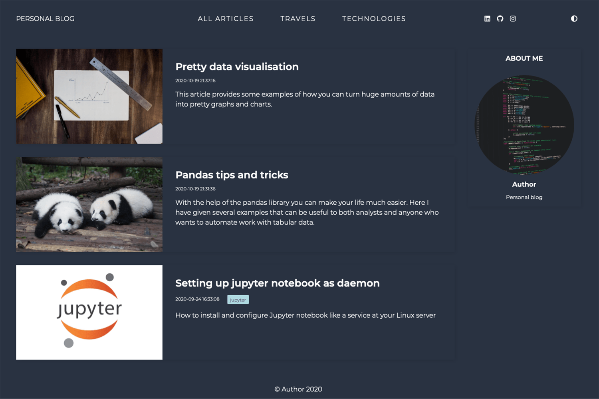

# Stada hugo theme



Minimalistic blog theme for [Hugo](https://gohugo.io) static website generator.

## Getting started

### Installation

Create a new Hugo project:
```bash
>> hugo new site {{name}}
```

Clone this repository into `themes/` directory:
```bash
>> cd {{name}}
>> git clone https://github.com/denisotree/hugo-theme-stada.git themes/stada
```

Enable theme with this line in the `config.toml` file:
```toml
theme = "stada"
```

### Configuration

In `config.toml` file, add variables in `params` section:

- `title`: website SEO title
- `description`: website SEO description
- `author`: author name
- `bio`: shorn author description
- `profilePicture`: path of file containing the author avatar image
- `favicon`: path to folder with favicons
- `mainSections`: list of sections that will be displayed on the main page of the site
- `yandexCounterId` id of [yandex metrika](https://metrika.yandex.com/) counter

To define social icons, add lines like in example (you could fing much more icones on [Font Awesome](https://fontawesome.com/icons?d=gallery&s=brands) website in `brands` section):

```
[[params.socialIcons]]
icon = "fa-linkedin"
title = "Linkedin"
url = "{{path_to_you_account}}"
```

To add a menu item, add the following lines in `menu`:

```
[[menu.main]]
name = "Travels"
weight = 200
identifier = "travels"
url = "/travels/"
```

[Read Hugo documentations](https://gohugo.io/content-management/menus/#readout) for more informations about menu

## License

This theme is released under the [**MIT**](/LICENSE.md) License.
